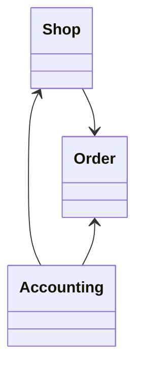

# s_nawa 상점
온라인 상점을 운영하여 거래를 진행할 수 있다.  
중고 거래: 사용자가 단품으로 거래 할 수 있다.

### 제약조건
* 상점에 관리자는 한 명
* 상품은 하나씩 등록 (단품 거래)

## 다이어그램

### 주문
* 상품 주문 
* 상품 주문 (전체)
* 상품 주문 대기
* 상품 주문 시작
* 상품 주문 결제 완료
* 상품 주문 배송 완료

### 정산
* 주문 조회 (정산) : 조건

### 상점 
* 상점 조회
* 상점 추가
* 상점에 사용자를 등록
* 사용자 조회
* 사용자 패스워드 체크
